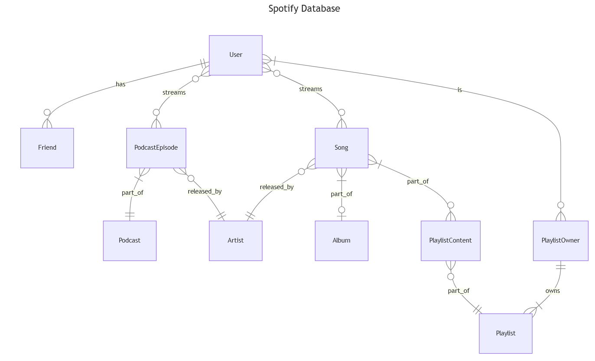

# Design Document

By ZEYD CHAMSI-PASHA

Video overview: <https://www.youtube.com/watch?v=BIfHj0JhdB0>

## Scope

The database CS50 Spotify includes all entities necessary to find your favorite songs, representing artists, playlists, albums, and more.

* Users, including basic identifying information
* Playlists, including when it was created and who created it
* Friends, including any connection between users
* Playlist owners, including the relationship between users and their playlists
* Artists, including basic identifying information
* Albums, including when it was released and by who
* Songs, including its genre, description, length, number of streams, when it was released, by who, and which album it belongs to if applicable
* Playlist contents, including the songs contained in each playlist
* Podcasts, including which artist this podcast belongs to
* Podcast episodes, including which podcast it belongs to, length, genre and number of streams

Keeping track of who streamed what, when and for how long is outside the scope of this database

## Functional Requirements

* CRUD operations regarding users, friends, artists and songs
* Tracking album streams, podcast streams, playlists shared
* Finding trending new songs

Beyond the scope of this database would be finding currently trending songs and podcast episodes, this would only be possible if we could track number of streams over time on a song or podcast over time. Analytics surrounding each stream logged would solve this.

## Representation

Entities are captured in SQLite tables with the following schema.

### Entities

The database includes the following entities:

#### Users

The `users` table includes:

* `id`, which specifies the unique ID for the student as an `INTEGER`. This column thus has the `PRIMARY KEY` constraint applied.
* `username`, which specifies the users name as `TEXT`, given `TEXT` is appropriate for name fields. A `NOT NULL` constraint ensures every user has a username. A `UNIQUE` constraint ensures no two users have the same username.
* `password`, which specifies the users password as `TEXT`, given `TEXT` is appropriate for password fields. A `NOT NULL` constraint ensures every user has a password.
* `email`, which specifies the users email as `TEXT`, given `TEXT` is appropriate for email fields. A `NOT NULL` constraint ensures every user needs an email to sign up. A `UNIQUE` constraint ensures no two users have the same email.
* `birth_date`, which specifies when the users birthday. Dates in SQLite can be conveniently stored as `NUMERIC`.
* `address`, which specifies the users address as `TEXT`, given `TEXT` is appropriate for address fields.
* `country`, which specifies the users country as `TEXT`, given `TEXT` is appropriate for country fields.

#### Friends

The `friends` table includes:

* `user1_id`, which represents the ID of one user in the friendship as an INTEGER. A FOREIGN KEY constraint references id in the users table, ensuring data integrity.
* `user2_id`, which represents the ID of the other user in the friendship as an INTEGER. This column has a FOREIGN KEY constraint referencing id in the users table.

The PRIMARY KEY constraint on the combination of user1_id and user2_id ensures each pair of friendships is unique. Additionally, each user ID pair has a CHECK constraint enforcing user1_id < user2_id to avoid duplicates and maintain the friendship order.

#### Playlists

The `playlists` table includes:

* `id`, which specifies the unique ID for each playlist as an INTEGER. This column has the PRIMARY KEY constraint applied.
* `name`, which specifies the name of the playlist as TEXT.
* `creation_date`, which specifies when the playlist was created. As with other timestamps, NUMERIC is appropriate.
* `original_owner_id`, which identifies the user who originally created the playlist as an INTEGER. A FOREIGN KEY constraint references id in the users table to maintain referential integrity.

All columns in the playlists table are required, except creation_date, which can be nullable if not set during insertion.

#### Playlist Owners

The `playlist_owners` table includes:

* `playlist_id`, which represents the ID of the playlist as an INTEGER. A FOREIGN KEY constraint references id in the playlists table.
* `user_id`, which represents the ID of a user who owns the playlist as an INTEGER. This column has a FOREIGN KEY constraint referencing id in the users table.

Both columns are required, and hence have the NOT NULL constraint applied. This table represents a many-to-many relationship between users and playlists.

#### Artists

The `artists` table includes:

* `id`, which specifies the unique ID for each artist as an INTEGER. This column has the PRIMARY KEY constraint applied.
* `name`, which specifies the artist's name as TEXT.
* `about`, which provides additional information about the artist as TEXT.

Only the name column is required, while about can be null.

#### Albums

The `albums` table includes:

* `id`, which specifies the unique ID for each album as an INTEGER. This column has the PRIMARY KEY constraint applied.
* `name`, which specifies the name of the album as TEXT.
* `release_date`, which specifies the release date of the album as NUMERIC.
* `artist_id`, which references the id of the artist as an INTEGER. This column has a FOREIGN KEY constraint referencing id in the artists table.

All columns in the albums table are required, except release_date.

#### Songs

The `songs` table includes:

* `id`, which specifies the unique ID for each song as an INTEGER. This column has the PRIMARY KEY constraint applied.
* `name`, which specifies the song title as TEXT.
* `genre`, which specifies the genre of the song as TEXT.
* `description`, which gives a brief description of the song as TEXT.
* `length`, which specifies the duration of the song. A NUMERIC type allows for flexibility in storing various time formats.
* `streams`, which counts the number of times the song has been streamed as an INTEGER.
* `release_date`, which specifies when the song was released as NUMERIC.
* `artist_id`, which identifies the artist of the song as an INTEGER. A FOREIGN KEY constraint references id in the artists table.
* `album_id`, which identifies the album the song is part of, as an INTEGER. A FOREIGN KEY constraint references id in the albums table.

The `name` and `artist_id` columns are required, while the other columns are optional.

#### Playlist Content

The `playlist_content` table includes:

* `playlist_id`, which represents the ID of the playlist containing the song as an INTEGER. A FOREIGN KEY constraint references id in the playlists table.
* `song_id`, which represents the ID of the song in the playlist as an INTEGER. A FOREIGN KEY constraint references id in the songs table.

Both columns are required, making this a junction table for the many-to-many relationship between playlists and songs.

#### Podcasts

The `podcasts` table includes:

* `id`, which specifies the unique ID for each podcast as an INTEGER. This column has the PRIMARY KEY constraint applied.
* `name`, which specifies the title of the podcast as TEXT.
* `artist_id`, which identifies the artist associated with the podcast as an INTEGER. This column has a FOREIGN KEY constraint referencing id in the artists table.

All columns are required in this table, given that each podcast must have a name and an associated artist.

#### Podcast Episodes

The `podcast_episodes` table includes:

* `name`, which specifies the episode title as TEXT.
* `podcast_id`, which identifies the associated podcast as an INTEGER. This column has a FOREIGN KEY constraint referencing id in the podcasts table.
* `length`, which specifies the duration of the episode as NUMERIC.
* `genre`, which specifies the genre of the episode as TEXT.
* `streams`, which counts the number of times the episode has been streamed as an INTEGER.

### Relationships

The below entity relationship diagram describes the relationships among the entities in the database.

As detailed by the diagram:

* A user can be friends with 0 to many other users. 0, if they do not have any friends, and many if they have established connections with multiple users. Each friendship between two users is unique, and friendship is mutual (i.e., if user A is friends with user B, user B is also friends with user A).

* A user can create 0 to many playlists: 0 if they have not created any playlists, and many if they have created multiple playlists. A playlist, however, is initially created by one and only one user, referred to as the original owner.

* A playlist can be associated with 1 to many users as owners, where the original creator is the first owner. This allows for shared ownership, where other users may also become associated with the playlist. A user, therefore, can own 0 to many playlists, reflecting their personal or shared collections.

* An artist can release 0 to many albums: 0 if they have yet to release any albums, and many if they have released multiple albums. Each album, however, is associated with one and only one artist.

* An album contains 0 to many songs. 0 if the album has no individual tracks associated with it, and many if it consists of multiple songs. Each song, however, is part of one and only one album, reflecting the album-song relationship.

* A song can be added to 0 to many playlists: 0 if the song has not been included in any playlist, and many if users have added it to multiple playlists. A playlist, conversely, can contain 0 to many songs, reflecting the user's choice of adding individual songs.

* An artist can produce 0 to many podcasts, depending on their output in that format. Each podcast, however, is produced by one and only one artist, establishing a direct link between the podcast and its creator.

* A podcast consists of 0 to many episodes. 0 if no episodes have been created, and many if there are multiple episodes under that podcast. Each episode, however, belongs to one and only one podcast, representing the parent-podcast relationship.

## Optimizations

Per the typical queries in queries.sql, it is common for users of the database to frequently retrieve playlists created by a particular user. For that reason, indexes are created on the username and email columns in the users table to speed up identification and retrieval of user-specific playlists.

Similarly, users often search for songs by genre or title. Therefore, an index is created on the name and genre columns in the songs table to optimize performance when filtering songs by these attributes.

To optimize relationship-based queries, such as retrieving all friends of a particular user, an index is added on the user1_id and user2_id columns in the friends table, speeding up queries that need to identify friends efficiently.

Triggers are also set up to maintain data consistency and automate actions based on table events. For example, a trigger on the streams column of the songs table automatically updates a summary table whenever a new stream is recorded, ensuring that streaming statistics are up-to-date without requiring additional manual updates.

Additionally, several views have been created to support efficient querying of popular and trending content:

* The `trending_new_songs` view displays the 50 most streamed songs released in the last month. It filters songs by release date using julianday to calculate recency and orders results by the number of streams in descending order, which is ideal for highlighting recent popular releases.

* The `most_popular_playlists` view identifies the 50 playlists with the highest number of unique owners. By joining the playlists table with playlist_owners and grouping by playlist ID, this view quickly identifies playlists that are widely shared or followed.

* The `most_streamed_songs` view provides the 50 most streamed songs overall by ordering songs by the streams column. This view supports quick reference to overall popularity without requiring complex filtering.

* The `most_streamed_albums` view aggregates streaming data for albums by summing the streams of all songs within each album. By joining the albums and songs tables, this view calculates total streams for each album and orders the results to provide a ranked list of the 50 most popular albums.

* The `most_streamed_podcasts` view aggregates streaming data for podcasts by summing the streams of each podcast’s episodes. This view joins podcasts and podcast_episodes, grouping by podcast ID to calculate total popularity and rank the top 50 podcasts.

These views enable quick access to commonly needed data about popular and trending content, improving the performance and usability of queries without directly querying the base tables each time.

## Limitations

* Lack of User Activity Tracking, while the schema allows for tracking streams in songs and podcast episodes, it does not record detailed user interactions such as when a user listens to a specific song, adds it to a playlist, or shares it. This activity data could be valuable for generating recommendations or tracking user preferences over time.

* No Detailed Song Attribution, in real music databases, each song may be associated with multiple artists, composers, or contributors. The current schema only links each song to one artist, which limits accurate representation of songs involving collaborations or guest appearances.

* Simplified Playlist Ownership, although playlist_owners provides shared ownership, it does not distinguish between the original creator of a playlist and users who have access to or have saved the playlist. A more robust system might include roles or permissions within the playlist, distinguishing between creators, contributors, and followers.

* Limited Podcast Structure, the schema currently associates a podcast with only one artist and allows for basic episode data. However, real-world podcasts often involve multiple hosts, guests, and complex episode metadata (e.g., duration, transcript). Extending the schema to include multi-host relationships and richer metadata could support these additional details.

* Sparse Genre and Categorization Information, although songs and podcast_episodes include a genre field, there is no separate genres table or detailed genre/subgenre hierarchy. Creating a dedicated genres table with a hierarchical structure could provide richer categorization options, enabling complex queries like "find all songs in subgenres of Rock."

* Limited Support for Recommendations, without a table to track user preferences, search history, or listening patterns, it’s challenging to generate personalized recommendations. Adding support for user ratings, last played timestamps, and liked or disliked songs would be beneficial for creating personalized playlists and recommendations.

* Sparse Album and Playlist Metadata, additional metadata such as album artwork, release types (e.g., single, EP, album), and playlist descriptions are not present in the current schema. This information is often essential for user interface display and for users to recognize and interact with content.
